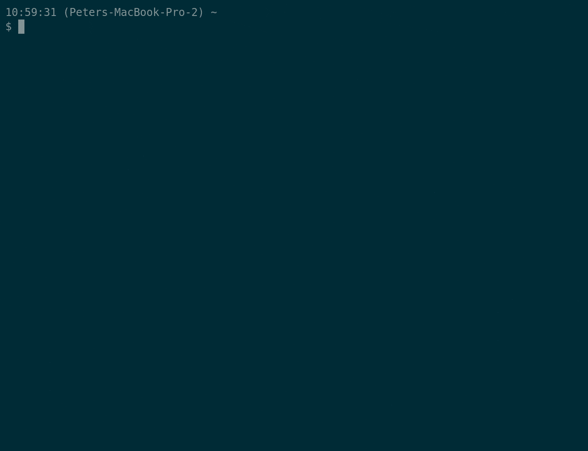

docker-media-player (mpsyt + pulseaudio)
========================================

mpyst and pulseaudio in docker. Made so that I can run my audio from a container
and therefore from my terminal, on OSX.



Steps
-----

1. Ensure pulse audio is running on your host:

```bash
pulseaudio --load=module-native-protocol-tcp --exit-idle-time=-1 --daemon
```

2. Run container with necessary volumes mounted:

```bash
docker run --rm \
  -e PULSE_SERVER=docker.for.mac.localhost \
  -v ~/.config/pulse:/home/pulseaudio/.config/pulse \
  -it \
  --name player \
  pemcconnell/mpsyt:0.1
```

Optional
--------

Add this to your `.bashrc` or other dotfiles and gain a `d_player` command:

```bash
d_player() {
  docker run --rm \
  -e PULSE_SERVER=docker.for.mac.localhost \
  -e http_proxy=$HTTP_PROXY \
  -e https_proxy=$HTTPS_PROXY \
  -v ~/.config/pulse:/home/pulseaudio/.config/pulse \
  -it \
  --name player \
  pemcconnell/mpsyt:0.1 "$@"
}
```

Shout-outs
----------

This is very much a combination of existing work by others:

 - https://github.com/jessfraz/dockerfiles/tree/master/pulseaudio
 - https://github.com/mps-youtube/mps-youtube

Alternatives
------------

https://github.com/tizonia/docker-tizonia/ is a very solid alternative.
Similarly you can add a convenience function in bash with:

```bash
d_player() {
  docker run --rm \
    -e PULSE_SERVER=docker.for.mac.localhost \
    -e http_proxy=$HTTP_PROXY \
    -e https_proxy=$HTTPS_PROXY \
    -v ~/.config/pulse:/home/tizonia/.config/pulse \
    -v ~/.config/tizonia:/home/tizonia/.config/tizonia \
    -ti \
    --name tizonia \
    pemcconnell/tizonia:latest "$@"
}
```
